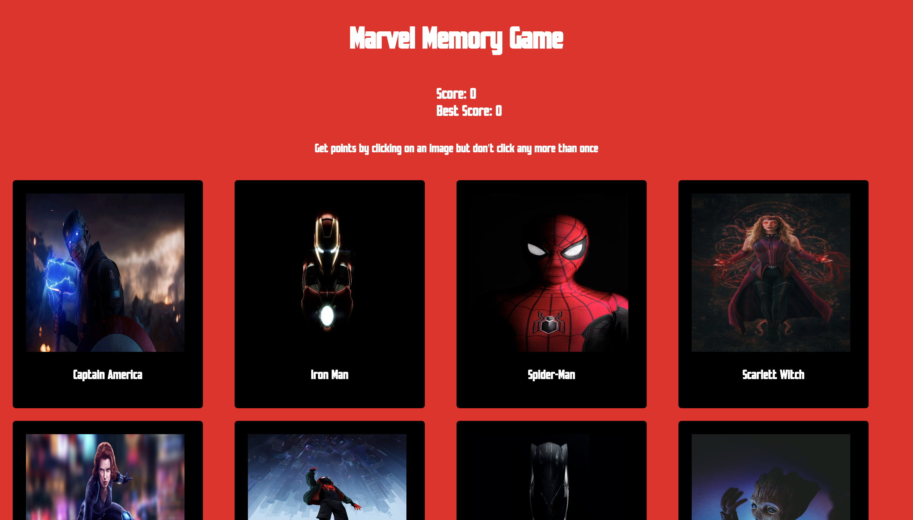

## Memory-Cards

A Marvel inspired Memory Game

#

## Screenshot

#

## Overview

- Project was created to further solidfy my understanding with React. Getting more comfortable with state/props.
- Some things that I can be added in the future:
- App can determine once the user has won the game
- Creating end-game functions signalfying to the user that game is over.

#

## Live Demo

[Marvel Memory Game](https://dynamic-faloodeh-39b6dd.netlify.app/)

#

## Technologies Used

#

## ENJOY THE GAME
